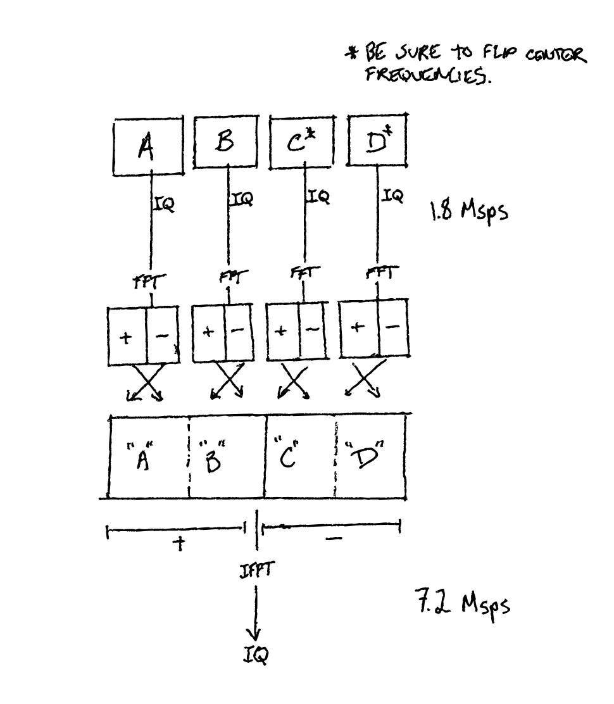
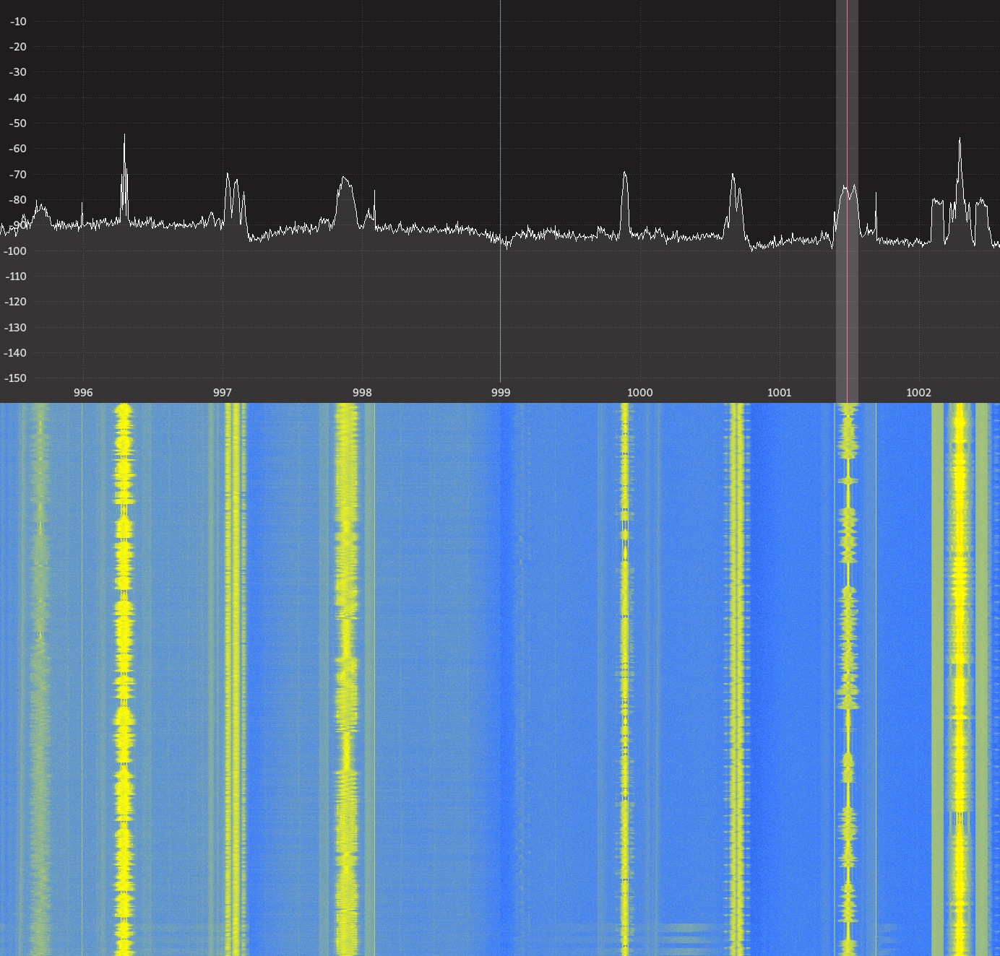

Title: How I used a KerberosSDR to recieve at 7.2 Msps
Date: 2020-09-20 22:31
Tags: go, rf, sdr
Category: sdr
Slug: kerberos-rtl-sdr-broadband
Author: Paul Tagliamonte
TwitterSite: @paultag
TwitterCreator: @paultag
TwitterImage: http://notes.pault.ag/static/rf.png

Over the last year, I've been spending all of my (limited) free time learning
how <abbr title="Radio Frequency">RF</abbr> devices work, and specifically,
how <abbr title="Software Defined Radios">SDRs</abbr> work. This lead me to
get an amateur radio license, and made a few new friends in the area too.
It's been incredibly humbling to set aside the subject areas I've worked
so many years to master, venturing into communities where I am once again
the novice in the room. Pushing myself has been a massive amount of work,
and work that causes me to question basic things about myself -- such as my
competence or capability as an engineer -- but it's been some of the most
rewarding in recent memory as I work through each hurdle.

I owe a deep debt of gratitude to those who have helped me along my way,
but most especially Raf, Tom and Ben. They've helped me work through the parts
that I've been most frustrated by, sent me piles of helpful resources, and
taken active steps to introduce me to the wider community, allowing me to
passively learn as others share their work. Thank you all.

It's about as good of a time as any to take a step back, and to write a bit
about what i've learned, and a hack that I've implemented for sport. This is
the first in a series of posts about the last year, and a bit about the code
I've been building. After I'm sure what I've built isn't a massive mistake,
I'll be publishing my example code in the hopes that it helps future learners.
Given that I'm not experienced enough to explain things simply, I'm going to
write up what I do learn, in the hopes that I can re-publish blog posts as I
learn enough to edit down my posts significantly.

Enter the KerberosSDR
---------------------

I've amassed a small flotilla of SDRs, which is fast becoming as bad of a habit
as my domain name collection. One of the most interesting devices I own is the
[KerberosSDR](https://othernet.is/products/kerberossdr-4x-coherent-rtl-sdr).
The KerberosSDR is 4
[rtl-sdr](https://en.wikipedia.org/wiki/Software-defined_radio#RTL-SDR) chips
that have a single clock source, meaning that the
<abbr title="or phasor - complex number of real and imaginary values in quadrature">IQ samples</abbr>
will represent the same instant in time across the four SDRs. This means you
can compare values from the 4 chips to eachother, which can enable things like
direction finding, or beamforming. Their customer service is *exceptional* (I
had to RMA a unit, and it was delt with extremely quickly, and with a lot of
truely great customer service), and I can't recommend them enough for anyone
looking to do coherent receive on a hobbyist budget.

Right, so, how do you align samples?
------------------------------------

The KerberosSDR contains some tricks on the hardware itself to help with
the process of aligning the 4 SDRs. The most important one is that by enabling
GPIO Pin #1, the KerberosSDR will switch from Antenna input to a random number
generator, returning random noise to the software.

<aside class="left">
There's a KerberosSDR rtl-sdr library fork, but I used the stock rtl-sdr
library. <code>rtlsdr_set_bias_tee</code> will toggle GPIO #1 under the hood.
</aside>

This would normally be fairly useless, but because the noise is fed to all the
radios at once, and random noise is not self-similar (meaning: it doesn't
repeat itself), we can cross-correlate our IQ streams to determine the relative
offsets between the radios. Since each radio is its own rtl-sdr device, the
first step is to start recieving on each SDR independently. For my setup, each
SDR's IQ samples will asynchronically be feed into a stream, where samples can
be read out independently of the block of samples being delivered to the
codebase. This allows us to read a fixed number of samples from each sample
stream.

Next, we need to cross-correlate each buffer in relation to the 0th device's
buffer. This will tell us what the relative offsets betwen our sample streams
is. We can either do this over the IQ samples (in the time domain) by either
doing what amounts to brute force (for each time offset, check to see how well
the signals line up), or we can do this in the frequency domain using some math
I don't understand. However, just because I don't entirely understand it
doesn't mean I can't use it, as evidenced by my frequent use of magnets, or
more distrubingly, airplanes.

If we preform a FFT to move our IQ data into the frequency domain, we can
then iterate over each buffer, multiplying the complex conjugate of that
buffer by the 0th SDR's buffer. That result can then be transformed back to
the time domain by preforming an IFFT, which will allow us to guess at the
best alignment by looking at the complex number's magnitude.

My implementation takes this cross-correlation, and runs it over 10 successive
windows of samples taken from the stream, and checks that all the alignment
offsets match down to the exact sample. If they do not, it loops until a stable
set of offsets is found. If the offset is positive, that means the Nth buffer
is ahead of the 0th buffer by that many samples, and if the offset is negative
the Nth buffer is behind the 0th buffer by that many samples. By checking for
the maximum alignment offset, we can read from the 0th stream until we are
aligned with the "last" SDR to start, and then read from each other stream to
match the now aligned 0th stream.

<aside class="right">
The output of the cross-correlation are time offsets. "positive" and
"negative" are represented by indexes in the first half or second
half of the values. This is similar to how FFTs are represented.
</aside>

From here on out, we have 4 streams of IQ samples where each sample that's read
from each stream at the same time represent the same instant in time, so long
as we always read the same exact number of IQ samples from each stream.
From here, we can do things like direction finding or beamforming to avoid
picking up noise from unwanted directions. This is a wildly complicated thing
to do with other hardware, but the KerberosSDR makes it really easy by using
commonly available hardware, and by integrating the on-device random number
generator to preform synchronization.

Sample Rate
-----------

One of the things I like least about the rtl-sdrs generally, is that max sample
rate is very low. Generally speaking, the amount of bandwidth that can be
observed is a function of the number of samples per second the hardware is
capturing. To see more spectrum, you need more readings -- which makes sense
when you think about it, since that's the only way to detect higher frequency
components.  With the rtl-sdr, as the sample rate increases, there's a bit of
corruption to work through, eventually rendering the signal unsable. I tend to
not like pushing my rtl-sdr beyond 2 Megasamples per second. It can be quite
frustrating to have to such a narrow view of the spectum. It feels like you're
watching the spectrum through a straw when you compare it to a high end hobby
SDR such as the [PlutoSDR](https://wiki.analog.com/university/tools/pluto) or a
full on professional SDR like the
[Ettus](https://www.ettus.com/product-categories/usrp-bus-series/) series.

But wait! The KerberosSDR has 4 SDRs! Why don't we tune each to adjacent
parts of the spectrum, and watch 4 different 1.8 MHz blocks of the spectrum
at once? We sure could, but I thought we could do one better.
Given that we know the bandwidth observed by each SDR, and we have samples in
perfect(ish) alignment, why don't we instead stick all the output samples that
come out of the SDRs together and use it as one large SDR at a much higher
sample rate?

Since we know the bandwidth each radio can observe (in my case, 1.8 MHz),
we can preform the alignment routine above and then tune each radio to 4
different frequencies, 1.8MHz apart. Since we can't easily sitch the samples
together in the time-domain, we're going to need to preform some FFTs and
operate in the frequency domain, and rely on the IFFT to fold our data back
into a time series. Most FFT libraries will return values in a format that
is a bit easier to program with, where the positive frequency bins come first,
and halfway through, it switches to the negitive ones. Given that we want to
combine our frequency ranges, we're going to need to shift the FFT values, since
the "0" frequency has moved, and we want our frequency range to go from the
negative values, through zero to the positive ones. We then have to either
preform another fft shift, or if we have an even number of devices, use the
copy function to write the data in an already shifted order. After we preform
the IFFT, we wind up with an IQ stream at 4 times the sample rate of the input
data, with 4 times the bandwidth.

Now, if we write all that IQ data that we generated to disk, and read it in at
the right sample rate, we can see the full result in `gqrx`.

